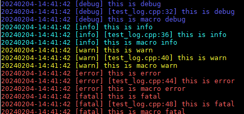

# lolog
Fast, Compiled, Async, C++ logging lib.
## Build & Install
```bash
git clone https://github.com/leaout/lolog.git
cd lolog && ./build.sh debug/release
make insall
```
## Platforms
- Linux, FreeBSD, OpenBSD, Solaris, AIX
- Windows (msvc 2008+, cygwin)
## Examples
### Basic usage
```c++
#include "Lolog.h"
using namespace lolog;

int main(int argc, char* argv[]){
    lolog::init_logging(argv[0],5,200<<20);
    lolog::set_log_level("Debug");

    debug("this is debug");
    DEBUGEX("this is debug");
    LODEBUG() <<"this is macro debug";

    info("this is info");
    INFOEX("this is info");
    LOINFO() <<"this is macro info";

    warn("this is warn");
    WARNEX("this is warn");
    LOWARN() <<"this is macro warn";

    error("this is error");
    ERROREX("this is error");
    LOERROR()<< "this is macro error";

    fatal("this is fatal");
    FATALEX("this is fatal");
    LOFATAL() << "this is macro fatal";
    return 0;
}

```
### Set stdout print
```c++
#include "Lolog.h"
using namespace lolog;

int main(int argc, char* argv[]) {
    lolog::init_logging(argv[0], 5, 200 << 20);
    lolog::set_log_level("Debug");
    lolog::set_std_out(true);

    debug("this is debug");
    info("this is info");
    warn("this is warn");
    error("this is error");
    fatal("this is fatal");
    return 0;
}
```
### Set print source code line
```c++
#include "Lolog.h"
using namespace lolog;

int main(int argc, char* argv[]) {
    lolog::init_logging(argv[0], 5, 200 << 20);
    lolog::set_log_level("Debug");
    lolog::set_std_out(true);
    lolog::set_print_file_line(true);

    debug("this is debug");
    info("this is info");
    warn("this is warn");
    error("this is error");
    fatal("this is fatal");
    return 0;
}
```
### Set color 
```c++
#include "Lolog.h"
using namespace lolog;

int main(int argc, char* argv[]) {
    lolog::init_logging(argv[0], 5, 200 << 20);
    lolog::set_log_level("Debug");
    lolog::set_color(true);

    debug("this is debug");
    INFO("this is info");
    WARN("this is warn");
    ERROR("this is error");
    FATAL("this is fatal");
    return 0;
}
```

  
### Set log file name format
```c++
#include "Lolog.h"
using namespace lolog;

int main(int argc, char* argv[]) {
    lolog::init_logging(argv[0], 5, 200 << 20);
    lolog::set_log_level("Debug");
    lolog::set_color(true);
    lolog::set_log_formate(0);

    debug("this is debug");
    INFO("this is info");
    WARN("this is warn");
    ERROR("this is error");
    FATAL("this is fatal");
    return 0;
}
```